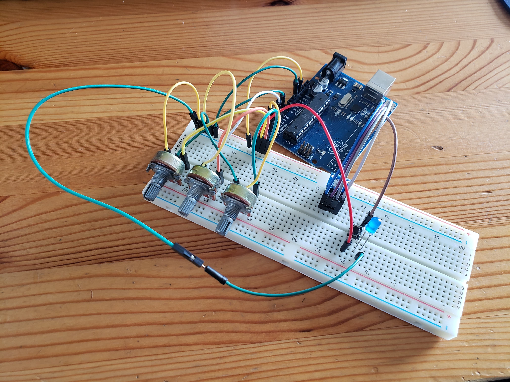
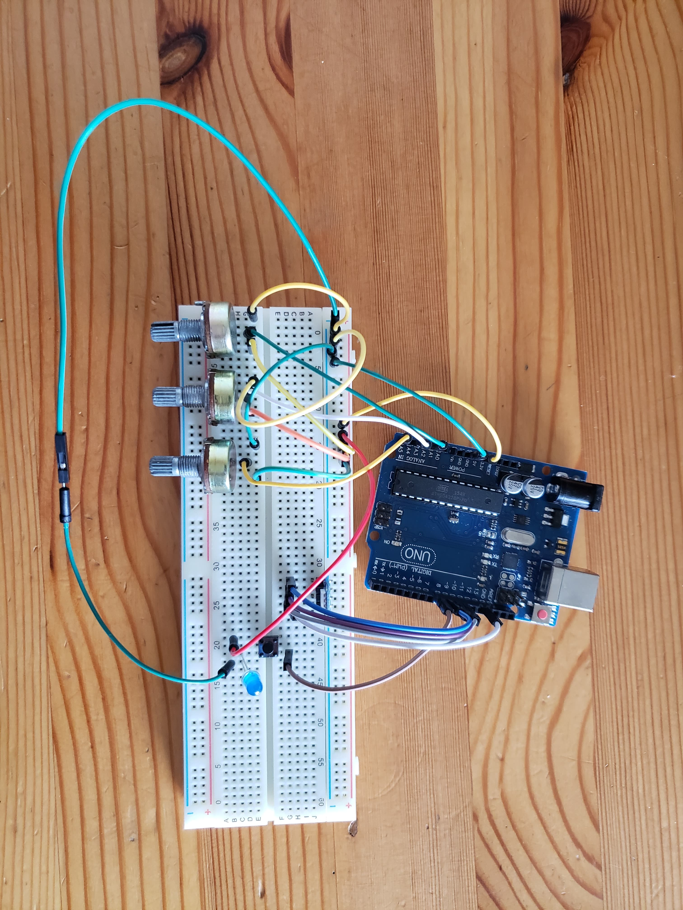

# Lamp-Project

Just making a lamp for fun. Not too sure how it will turn out or what I will make of it but [some amount of time]ly updates here.

## Project Started - 08.01.2020:

Today I worked on the electronic schematics and general code functionality for the lamp. I have three modes working individually (off, custom color choice, and automatic color scroller) and tried to integrate them together successfully but was unable to. Hopefully I'll be able to fix that soon and also start building the wooden base and resin diffuser!

